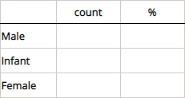
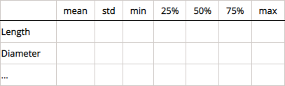
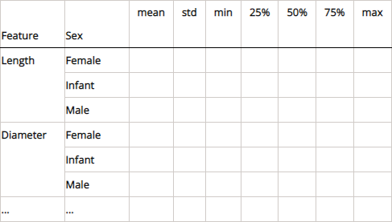

# **Opis**

Zadanie polega na przeprowadzeniu analizy statystycznej przygotowanego zbioru danych. 
Dane podlegające analizie dotyczą ślimaków nazywanych słuchotkami (lub uchowcami). 
Zbiór obejmuje 9 atrybutów (cech) charakteryzujących te ślimaki i zawiera 4177 obserwacji.
Analizę należy przeprowadzić przy użyciu środowiska Jupyter Notebook i udokumentować w postaci notatnika stworzonego w tym środowisku.

# **Wymagania na ocenę dostateczną**

1. Korzystając z pakietu Pandas, dla znajdującej się w zbiorze danych cechy jakościowej stworzyć tabelę rozkładu tej cechy, która ma mieć następującą budowę:
    - wiersze - mają odpowiadać poszczególnym wariantom cechy;
    - kolumny:
      1. nazwa wariantu cechy,
      2. liczebność,
      3. udział procentowy (zaokrąglony do dwóch miejsc po przecinku).
    
    Tabela powinna mieć następujący układ:
    

    
2. Korzystając z pakietu Pandas, dla znajdujących się w zbiorze danych cech ilościowych stworzyć tabelę miar rozkładów tych cech, która ma mieć następującą budowę:
    - wiersze - mają odpowiadać poszczególnym cechom;
    - kolumny:
      1. nazwa cechy, 
      2. średnia arytmetyczna,
      3. odchylenie standardowe,
      4. minimum,
      5. pierwszy kwartyl,
      6. mediana (drugi kwartyl),
      7. trzeci kwartyl,
      8. maksimum.
    
    Tabela powinna mieć następujący układ:
   
    

    
3.Korzystając z wybranego pakietu spośród Matplotlib, Pandas lub Seaborn, dla znajdującej się w zbiorze danych cechy jakościowej stworzyć wykres słupkowy liczebności poszczególnych wariantów tej cechy.

4.Korzystając z wybranego pakietu spośród Matplotlib, Pandas lub Seaborn, dla każdej ze znajdujących się w zbiorze danych cech ilościowych stworzyć histogram tej cechy. Wszystkie histogramy mają zostać umieszczone na wspólnym obszarze wykresów w układzie zawierającym 4 wiersze i 2 kolumny.

# **Wymagania na ocenę dobrą**

1. Zrealizować wszystkie wymagania na ocenę dostateczną.
   
2. Korzystając z wybranego pakietu spośród Matplotlib, Pandas lub Seaborn, dla każdej pary cech ilościowych znajdujących się w zbiorze danych stworzyć wykres punktowy. Wszystkie wykresy punktowe mają zostać umieszczone na wspólnym obszarze wykresów w układzie zawierającym 14 wierszy i 2 kolumny.

3. Korzystając z pakietu Pandas, dla wszystkich cech ilościowych znajdujących się w zbiorze danych stworzyć tabelę zawierającą macierz korelacji liniowej tych cech.

4. Korzystając z pakietu Seaborn, dla wszystkich cech ilościowych znajdujących się w zbiorze danych stworzyć wykres reprezentujący macierz korelacji liniowej tych cech w postaci mapy cieplnej.

5. Korzystając z pakietu Seaborn, dla dwóch cech ilościowych najmocniej skorelowanych liniowo stworzyć wykres regresji liniowej.

# **Wymagania na ocenę bardzo dobrą**

1. Zrealizować wszystkie wymagania na ocenę dobrą.

2. Korzystając z pakietu Pandas, dla znajdujących się w zbiorze danych cech ilościowych stworzyć tabelę miar rozkładów tych cech z podziałem na poszczególne warianty cechy jakościowej, która ma mieć następującą budowę:
   - wiersze - mają odpowiadać kombinacjom poszczególnych cech ilościowych i wariantów cechy jakościowej;
   - kolumny:
     1. nazwa cechy ilościowej,
     2. nazwa wariantu cechy jakościowej,
     3. średnia arytmetyczna, 
     4. odchylenie standardowe,
     5. minimum,
     6. pierwszy kwartyl,
     7. mediana (drugi kwartyl),
     8. trzeci kwartyl,
     9. maksimum.
    
    Tabela powinna mieć następujący układ:

    
3. Korzystając z wybranego pakietu spośród Matplotlib, Pandas lub Seaborn, dla każdej ze znajdujących się w zbiorze danych cech ilościowych stworzyć wykres pudełkowy tej cechy z rozróżnieniem poszczególnych wariantów cechy jakościowej. Wszystkie wykresy pudełkowe mają zostać umieszczone na wspólnym obszarze wykresów w układzie zawierającym 4 wiersze i 2 kolumny.